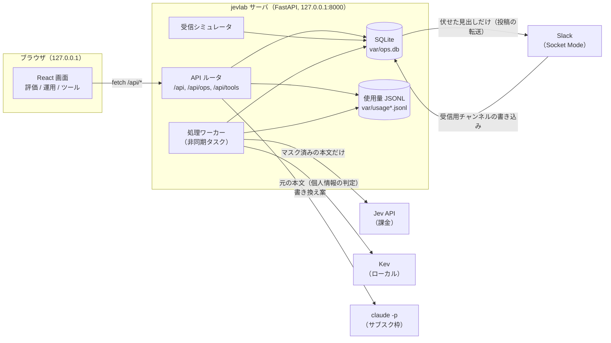
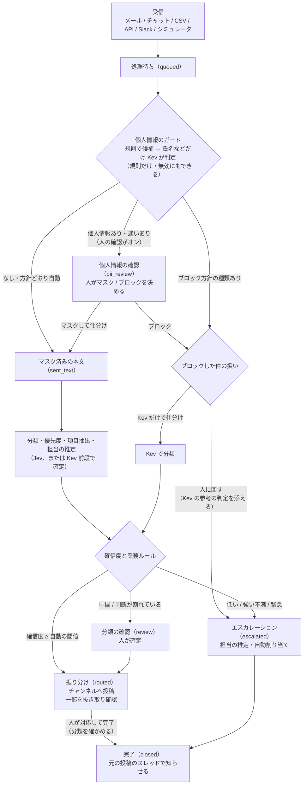

# アーキテクチャ

> 対象: 2026-09-26 時点のコード（`src/jevlab`、`frontend/src`）。コードを変えたら、区切りでこの文書も更新する。

## 1. システムの全体像

jevlab は 1 つの FastAPI サーバと、それが配信する React の画面でできています。判定は 3 つの接続先を切り替えて使います。

| 接続先 | 中身 | 課金 | 用途 |
| --- | --- | --- | --- |
| `jev` | TypeSafe の Jev API（`https://api.typesafe.ai`） | あり（入力トークンのみ） | 本番想定の判定 |
| `custom` | Kev（Jev 互換のローカルサーバ。既定 `http://127.0.0.1:8009`、CPU 実行） | なし | 閉域・個人情報の判定・比較 |
| `mock` | API を呼ばず、HTTP 層で決まった答えを返す | 模擬料金だけ記録 | 開発・テスト・デモ |

- API キーはサーバ側だけで扱い、ブラウザには渡しません。
- サーバは `127.0.0.1` だけで待ち受けます（外部から接続できない）。

## 2. 構成要素

### 2.1 サーバの入口 — `src/jevlab/web.py`

- **lifespan（起動と停止）**
  - 接続先ごとに SDK のクライアントと使用量の記録（`Ledger`）を作ります。
  - 運用用の `Store`（SQLite）と `Pipeline` を作ります。
  - **処理ワーカー**・**受信シミュレータ**・**Slack のコネクタ**を非同期タスクとして動かします。
  - Slack のコネクタは、トークン（`SLACK_BOT_TOKEN`・`SLACK_APP_TOKEN`）がなければその方向を「未設定」として何もしません。
  - 停止時はタスクを取り消し、処理中の件は次回起動時に「処理待ち」へ戻ります。
- **接続先の選択**
  - 各 API は `?target=jev|custom|mock` で接続先を選びます。
  - 省略時は環境変数 `JEVLAB_DEFAULT_TARGET` で決まる既定の接続先を使います。
  - Jev は `TYPESAFE_API_KEY` があるときだけ有効です。
- **画面の配信**
  - `frontend/` の Vite ビルド出力（`src/jevlab/static/`）を `/static` で配信します。
  - 画面のパス（`/`、`/eval/*`、`/ops/*`、`/tools/*`）には `index.html` を返します（SPA）。
  - 以前の URL（`/apps/*`）も受け付け、画面側で `/eval/apps/*` に移します。

### 2.2 共通部品 — `src/jevlab/core/`

| モジュール | 役割 |
| --- | --- |
| `target.py` | 接続先の決定（環境変数だけで決まる）。Kev の URL・鍵、Jev が使えるかの判定 |
| `client.py` | 接続先ごとのクライアント生成。モックの応答（確信度は本物と同じ式で計算）。予算チェック付きの呼び出し `judge()` |
| `confidence.py` | Jev の確信度の定義。Choice は最大確率を当て推量（1/N）から見た伸びに、Score は段階の散らばりから計算する（最大確率そのものではない） |
| `kev_health.py` | Kev に接続できるかの確認（5 秒は結果を使い回す）。使えないときは画面のヘッダーに理由を出す |
| `budget.py` | 使用量の記録（JSONL）と予算ガード。料金は入力トークン $0.042 / 100 万。上限は `JEVLAB_BUDGET_USD`（既定 $1）。Jev の累計は `var/usage.jsonl`、他は `usage.<target>.jsonl` |
| `engine.py` | 評価アプリの定義（`AppSpec`）、判定結果の共通形（`AnswerView`）、評価（正解率・Brier・ECE・信頼度図） |
| `metrics.py` | 評価指標の計算 |
| `runs.py` | 評価結果の保存（`var/runs.jsonl`） |
| `generator.py` | 文章の生成器（`Generator` の型）。いまは `claude -p` を子プロセスで呼ぶ実装だけ（[ADR-0009](adr/0009-claude-cli-generator.md)） |

### 2.3 評価アプリ — `src/jevlab/apps/`

1 アプリ = 質問の定義（`questions.py`）＋画面の表示名と正解データ（`spec.py`、`dataset.jsonl`）です。

| アプリ | 内容 |
| --- | --- |
| mail | 雑貨店のメール 100 通の仕分け（分類・不満度・緊急度）。運用ダッシュボードの分類もこの質問を使う |
| triage | SaaS への問い合わせの部署・怒り度・返金要求・緊急度 |
| incident | 障害第一報の重大度・原因箇所・顧客影響 |
| moderation | 掲示板投稿の誹謗中傷・個人情報・宣伝・危険行為 |
| commit | コミットの種別・破壊的変更・影響 |
| contract | 利用規約の条項リスク |
| slop | SNS 投稿の「スロップ」検知 |
| rewrite | 書き換えで意味が保たれているか |

評価ダッシュボードでは、同じデータを Jev / Kev / モックで判定して、正解率と較正（確信度の当たり具合）を並べて比べられます。

### 2.4 運用（受付箱） — `src/jevlab/ops/`

| モジュール | 役割 |
| --- | --- |
| `models.py` | 件（`Item`）、経過（`Event`）、投稿（`Post`）、検知漏れの報告（`MissReport`）、設定（`Settings`。分類の一覧 `categories` と受け皿、定義の版を含む）の型 |
| `store.py` | SQLite への保存。1 本の接続をロックで守り、読み出し・変更・保存を 1 トランザクションで行う（`update`）。番号は受付箱を空にしても戻さない |
| `pii.py` | 個人情報の候補を規則（正規表現と語彙）で拾う・マスクする |
| `questions.py` | 個人情報・仕分け・優先度・項目抽出・担当者の推定の質問（分類の選択肢は設定の分類から作る） |
| `pipeline.py` | 1 件の処理の流れと、人の操作（確認・割り当て・完了） |
| `simulator.py` | デモの受信（`demo_inbox.jsonl` の 64 件を一定間隔で流す） |
| `tuning.py` | 閾値の調整（正解の分かっている件から、閾値ごとの自動処理率と誤り率を出して提案する。既定で、いまの分類の定義の版の件だけで数える） |
| `misses.py` | 検知漏れの報告の集計。「候補外に残っている可能性」の閾値をどこまで下げれば見逃しの何割を拾えたかと、増える確認の件数を出す |
| `importers.py` | 既存の問い合わせのファイルを読む（CSV の UTF-8／Shift_JIS、.xlsx、.eml・mbox、Slack のエクスポート）。標準ライブラリだけで読む |
| `audit.py` | 監査ログの CSV。差出人・メモの本文・個人情報の候補を伏せ、経過の詳しいデータは出さない（[ADR-0026](adr/0026-audit-log-csv-without-content.md)） |
| `kev_queue.py` | Kev の処理待ち。次の段階で Kev を使う件の数と、最近 20 回の Kev の所要時間の中央値から、処理し終えるまでの見込みを出す（overview の `kev_queue`） |
| `pii_eval.py` | 個人情報の判定（Kev）の混同行列。人が確認した件だけで、候補ごとと「候補外の残り」を集計する |
| `sla.py` | エスカレーションの対応目安。営業時間（曜日・時刻・休業日）だけを数える |
| `slack.py` | 実際の Slack とのつなぎ込み（Socket Mode）。投稿の転送・エスカレーションのスレッド・対応目安前の知らせ・受信の取り込み（[ADR-0013](adr/0013-slack-socket-mode.md)） |
| `api.py` | `/api/ops/*` の API |

### 2.5 ツール — `src/jevlab/tools/`

- `tone.py`: 言い方チェックの質問と、判定のまとめ方を定義します。
  - 観点を 4 つのまとまりで判定します（伝わり方・丁寧さ・分かりやすさ・謝罪）。
  - 文面の目的と、受け取る印象も判定します。
  - 文ごとに、きつさを判定します（画面の「きつく見える文」）。
  - 相手（上司・同僚・部下・取引先・お客様・友人・家族・指定なし）と場面（チャット・メール・指定なし）を state に入れます。
  - Claude に書き換え案を頼むときのプロンプトもここに置いています。
- `contract.py`: 契約・規約チェック。本文を条項（第N条・番号・空行）に分け、評価アプリ「契約条項のリスク判定」の質問（自動更新・違約金・責任制限・第三者提供の Noul と、不利さの Score）を条項ごとに 1 回の問い合わせで判定します。やさしい説明は Claude に頼みます。法的助言ではない旨を画面と API の結果に出します。
- `reply.py`: 返信前チェック。問い合わせと返信の下書きから、質問に答えているか・方針を超えた約束・謝罪（足りない／適切／過剰）・足りない情報（候補ごとの Noul）・言い方（言い方チェックの観点を流用）を 1 回で判定します。個人情報の候補は規則ですべて伏せてから Jev・Claude に送ります。直した案は Claude が作り、判定し直して前後を比べます。
- `api.py`: `/api/tools/tone*`・`/api/tools/reply*`・`/api/tools/contract*` の API です。
  - 判定は選んだ接続先で行います。
  - 書き換え案は生成器（Claude）で作ります。モデルは sonnet（既定）と opus だけ（haiku は遅く出力も長いため外した）。

### 2.6 画面 — `frontend/src/`

- Vite 8、React 19、TypeScript（strict）、react-router 8 で作っています。
- `npm run build` の出力は `src/jevlab/static/` に置かれ、FastAPI がそのまま配信します（[ADR-0011](adr/0011-single-repo-vite-build.md)）。
- 画面のまとまり:
  - 最初の画面: `/`（運用ダッシュボード `/ops` に移る）
  - 評価ダッシュボード: `/eval`、`/eval/apps/:name`、`/eval/apps/:name/run`
  - 運用ダッシュボード: `/ops`、`/ops/inbox|pii|review|escalations|channels|staff|connectors|tuning|settings`、`/ops/items/:id`（受付箱 `/ops/inbox?id=` へ移す）
  - ツール: `/tools/tone`、`/tools/reply`（`?item=` で件の問い合わせを入れる。件の詳細の「返信前チェック」から開く）、`/tools/contract`
- 運用の画面は 1.5 秒間隔のポーリングで更新します（`ops/state.tsx` の `usePolling`）。

## 3. 1 件の流れ

要点:

1. **Jev に元の本文は送りません。**
   - 送るのは `sent_text`（方針どおりマスクした本文）だけです。
   - 個人情報の判定は、元の本文を読む必要があるため Kev（ローカル）で行います（[ADR-0002](adr/0002-kev-pii-guardrail.md)）。
2. **形で決まる個人情報は規則で確定します。** 電話・メール・郵便番号・住所・カード・口座・生年月日・SNS アカウント（[ADR-0021](adr/0021-sns-accounts-as-pii.md)）がこれに当たります。モデルに聞くのは、規則で決めきれない氏名の候補と、「候補以外に個人情報が残っていないか」の 2 種類だけです。
   - 設定でモデルを使わない（規則だけ）にもできます。このときは氏名などの候補をすべて個人情報として扱い、候補外の確認は行いません。Kev を呼ばないので速くなります。
   - ガード自体を無効にすると、元の本文のまま Jev に送ります（デモ用。通常は有効）。
   - モデルが個人情報と言い切らなかった候補（未確定の候補）も、見逃しを避けるため人の確認に回します。
3. **1 回の問い合わせにまとめます。** 分類・不満度・緊急度・返金・公にする可能性・項目の抽出（注文番号・期限・金額）・担当者の推定は、独立した質問なので 1 回の問い合わせで並列に判定します。
4. **振り分けの決め方** — `pipeline.decide_route` で次の順に決めます。
   - 強い不満（不満度 2 の確率が既定 0.35 以上）・緊急なら、確信度に関係なく人（エスカレーション）に回します。
   - それ以外は確信度で分けます。自動の閾値（分類ごとに上書きできる）以上なら振り分け、確認の閾値以上なら「分類の確認」、それ未満ならエスカレーションです。
   - 自動の閾値以上でも、判断が割れているときは「分類の確認」に回します。分類の上位 2 つの確率の差が既定 0.1 未満のときと、不満度が両端に割れているときです（[ADR-0017](adr/0017-confidence-semantics.md)）。
   - 担当の自動割り当ては、確信度ではなく推定した担当の確率で決めます（選択肢の数＝人数で確信度の意味が変わるため）。
5. **優先度は、判定した値から画面側で計算します。** 観点ごとの値（0〜1）を重み付きで平均します。重みを変えても判定し直す必要はありません（[ADR-0006](adr/0006-priority-in-code.md)）。
6. **振り分けた件の一部を抜き取り、人が確認します**（既定 5%）。正誤の実績は閾値の調整に使います（[ADR-0007](adr/0007-human-in-the-loop-queues.md)）。
7. **ブロックした件は、Kev で参考に判定します。** 人に回す場合も、分類と担当の推定を Kev（ローカル）で出して `kev_reference` に残します。人が仕分ける手がかりにするだけで、自動の振り分け・割り当てには使いません。規則だけの設定では行いません。
8. **検知漏れは、送った後から報告できます。** Jev に送った件で個人情報の見逃しに気づいたら、件の詳細から種類と位置を報告します。本文は取り消せないので、改善（「候補外に残っている可能性」の閾値の見直し）のための記録です。個人情報そのものは保存しません。
9. **振り分けた件も、人が対応して完了にします。** 件の詳細で最終の分類（最初はいまの分類）を確かめて完了にします。触らなければ「合っていた」、切り替えれば「修正した」として記録し、閾値の調整の正解に数えます（[ADR-0014](adr/0014-close-routed-items-in-jevlab.md)）。
10. **エスカレーションには対応目安があります。** 既定は 9 営業時間（平日 9:00〜18:00 の 1 営業日）で、昼休み・夜間・休日は進みません。

## 4. データモデル

`var/ops.db`（SQLite）の 6 つの表:

| 表 | 中身 |
| --- | --- |
| `items` | 件。`id`・`seq`・`status` は列、それ以外は JSON（`data`） |
| `events` | 件ごとの経過（受信・ガード・分類・振り分け・人の操作）。画面のタイムラインになる |
| `posts` | 疑似 Slack への投稿（実際の Slack への転送もここから） |
| `pii_misses` | 検知漏れの報告（種類・位置・長さ・報告時の「候補外に残っている確率」。個人情報そのものは保存しない） |
| `seen_messages` | Slack から取り込んだメッセージのキー（再接続で同じメッセージを二重に取り込まないため） |
| `settings` | 運用の設定（JSON 1 行）と、番号の続き（`last_seq`） |

`Item` の主な項目（`ops/models.py`）:

| 項目 | 意味 |
| --- | --- |
| `status` | `queued` → `processing` →（`pii_review`）→ `review` / `escalated` / `routed` → `closed`（失敗は `error`） |
| `text` | 判定に使う文（「件名: …」＋本文）。個人情報の位置はこの文字列の中の位置 |
| `pii` | 個人情報の候補（`Span`: 位置・種類・出どころ（規則 / 人）・モデルの確率・確定したか） |
| `pii_leftover` | 候補以外に個人情報が残っている確率 |
| `pii_draft` | 人が確認画面で編集中の内容（未確定の下書き。[ADR-0010](adr/0010-server-side-pii-draft.md)） |
| `pii_decision` | `none` / `masked` / `allowed` / `blocked` / `skipped`（ガードが無効） |
| `sent_text` | 外部（Jev）に送った本文。送っていなければ `null` |
| `answers` | 質問ごとの判定（`AnswerView`: 予測・値・確信度・確率） |
| `category` / `confidence` / `decided_by` | 分類・確信度・誰が決めたか（jev / kev / mock / human） |
| `fields` | 抽出した項目（注文番号・期限・金額） |
| `assignee` / `assigned_by` / `auto_assigned` | 担当者・割り当てた主体・一度でも自動で割り当てたか |
| `assign_suggestion` / `assign_confidence` | モデルが推定した担当と確信度（割り当てなかった場合も残す） |
| `kev_reference` | ブロックした件を Kev で参考に判定した結果（分類・担当の推定） |
| `slack_channel` / `slack_ts` / `slack_notified` / `slack_reminded` | 実際の Slack に投稿した件の親メッセージ（振り分け・エスカレーションの最初の投稿）と、返信・知らせを送ったか |
| `audit` / `audit_result` | 抜き取り確認の対象か・結果 |
| `expected` | デモデータの想定ラベル、または取り込んだ過去の分類（評価・試算用） |
| `backfill` | 過去の問い合わせとして取り込んだ件（試算用）。仕分けまで行い、投稿・人の対応には回さず完了にする。運用の集計に入れない |

## 5. API の一覧

| パス | 内容 |
| --- | --- |
| `GET /api/status` | 接続先ごとの状態（使えるか・累計額・上限） |
| `GET /api/apps`、`/api/apps/{name}`、`/samples` | 評価アプリの一覧・定義・例 |
| `POST /api/apps/{name}/judge`、`/samples/{id}/judge`、`/evaluate`、`/summary` | 判定・評価 |
| `GET /api/runs/latest`、`/api/apps/{name}/runs` | 評価の記録 |
| `GET /api/ops/meta`、`/overview`、`/items`、`/items/{id}` | 運用の定義・集計・件 |
| `POST /api/ops/ingest`、`/chat`、`/import` | 受信（手入力・チャット・ファイル）。`/import` は過去の分類・受信日時・試算用（`backfill`）を受け付ける |
| `POST /api/ops/import/parse` | 取り込むファイル（base64）を読み、表かメッセージにして返す |
| `POST /api/ops/items/{id}/pii`、`PUT /items/{id}/pii/draft` | 個人情報の確定・下書きの保存 |
| `POST /api/ops/items/{id}/miss`、`GET /misses` | 検知漏れの報告・その集計 |
| `GET /api/ops/audit.csv`、`/audit/exports` | 監査ログの CSV（期間・件・種類・文字コードで絞る）と、書き出しの記録 |
| `GET /api/ops/pii-eval` | 個人情報の判定の混同行列（人が確認した件だけ） |
| `POST /api/ops/items/{id}/decide`、`/assign`、`/note`、`/close`、`/retry` | 人の操作（`/close` はエスカレーション中と振り分け済みの件） |
| `POST /api/ops/bulk/pii`、`/bulk/assign` | まとめて処理（件ごとに成否を返す） |
| `GET /api/ops/assignment` | 担当者の推定の当たり具合 |
| `GET/PUT /api/ops/settings` | 運用の設定 |
| `POST /api/ops/simulator`、`/reset`、`GET /posts`、`/tuning` | シミュレータ・初期化・投稿・閾値の調整 |
| `GET /api/ops/slack` | Slack のコネクタの状態（トークンの有無・送信と受信の状態・件数・エラー）。トークンの値は返さない |
| `GET /api/tools/tone/meta`、`POST /api/tools/tone`、`/tone/rewrite` | 言い方チェック |
| `GET /api/tools/reply/meta`、`POST /api/tools/reply`、`/reply/rewrite`、`/reply/draft`、`/reply/suggest/stream` | 返信前チェック（判定・AI返信案。`suggest/stream` は書いた分から 1 行 1 つの JSON で返すストリーミング） |
| `GET /api/tools/contract/meta`、`POST /api/tools/contract`、`/contract/explain` | 契約・規約チェック（判定・やさしい説明） |

エラーの返し方:

| ステータス | 意味 |
| --- | --- |
| 404 | 件がない |
| 409 | 予算の上限・コネクタが切断されている |
| 422 | 入力や状態の不正 |
| 502 | 判定・生成の失敗 |

## 6. 設定（`Settings`）

| まとまり | 主な項目 | 既定 |
| --- | --- | --- |
| `guard` | 有効・モデルで判定するか（オフで規則だけ）・判定の接続先（Kev / モックのみ。Jev は選べない）・人の確認・候補の閾値・残りの閾値・種類ごとの方針（検出のみ / マスク / ブロック）・ブロックした件の扱い | 有効、モデルで判定、Kev、人の確認あり、0.3、0.5、カード・口座はブロック、他はマスク、人に回す |
| `classify` | 接続先・自動の閾値・確認の閾値・分類ごとの閾値・強い不満 / 緊急をエスカレーションするか・強い不満とみなす確率・僅差とみなす差 | Jev、0.9、0.5、0.35、0.1 |
| `kev_first` | Kev の確信度が十分なら Jev を呼ばずに確定する | 無効、0.95 |
| `assign` | 自動割り当て・その閾値（推定した担当の確率）・対応例を渡すか・例の数 | 有効、0.7、渡す、3 |
| `staff` | 担当者（ID・名前・所属・担当範囲・Slack ID・担当のオン／オフ）。オフの人は推定・割り当て・振り分け担当から外れる | 4 人のデモ担当者 |
| `priority_weights` | 優先度の重み | 不満 1.0 / 緊急 1.5 / 返金 0.8 / 公にする 1.2 |
| `sla` | 対応目安（営業時間）・営業日・営業時間・タイムゾーン・休業日 | 9 時間、月〜金、9:00〜18:00、Asia/Tokyo |
| `slack` | 投稿の転送・疑似チャンネルごとの Slack チャンネル ID・受信するチャンネル ID・振り分け担当（当番）・画面へのリンクの起点・対応目安前の知らせ | 転送しない、`http://127.0.0.1:5173`、60 分前に知らせる |
| `audit_rate`、`connectors`、`simulator` | 抜き取りの割合・コネクタの接続・シミュレータ | 5%、Slack 以外は接続（Slack は切断） |

主な環境変数:

| 変数 | 意味 |
| --- | --- |
| `JEVLAB_DEFAULT_TARGET` | 既定の接続先 |
| `JEVLAB_BUDGET_USD` | 予算の上限 |
| `JEVLAB_VAR_DIR` | データの置き場所（既定 `var/`） |
| `KEV_URL`、`KEV_TIMEOUT_S` | Kev の接続先・タイムアウト（既定 120 秒） |
| `JEVLAB_GENERATOR` | 生成器の種類（いまは `claude-cli` だけ） |
| `JEVLAB_CLAUDE_USE_API_KEY=1` | `claude -p` に API キーを渡して API 課金で動かす |
| `SLACK_BOT_TOKEN`、`SLACK_APP_TOKEN` | 実際の Slack への送信（xoxb-）と受信（xapp-）。なければその方向は「未設定」 |

## 7. 安全の境界

| 守るもの | 仕組み |
| --- | --- |
| **元の本文を Jev に送らない** | Jev に送るのは `sent_text` だけ（`_classify_and_route` は `sent_text` がないと例外）。個人情報の判定の接続先は型で Kev / モックに限定（`GuardTarget`）。ブロックした件は Jev を通さない |
| **マスクの漏れを防ぐ** | 重なった候補は結合してから伏せる。方針にない種類は安全側（マスク）。規則で確定した構造的な個人情報は、画面から外されてもサーバ側で戻す（送られてきた内容をそのまま信じない）。一括処理では未確定の候補もマスク |
| **外に出る見出しから漏らさない** | チャンネル投稿・担当の対応例の見出し（`safe_title`）は、未確定を含むすべての候補を伏せる。対応例は「送ってよいと判断済み」かつ「人が割り当てた」件だけ |
| **Slack に流すもの** | 転送するのは伏せた見出しの投稿（#cs-… とエスカレーション）と、件の詳細へのリンク（127.0.0.1 なので自分の PC でしか開けない）だけ。お問い合わせ窓口（元の本文）は、チャンネル ID を割り当てても送らない。Slack から受信した本文は、ほかの経路と同じくガードを通す |
| **秘密情報** | 鍵は `.env` に置き、起動時に `uv run --env-file .env` で環境変数として読む。コードは `.env` を直接読まない。鍵はブラウザに返さない |
| **ネットワーク** | サーバは `127.0.0.1` だけで待ち受ける |
| **`claude -p` の子プロセス** | `TYPESAFE_*`・`KEV_*`・`ANTHROPIC_API_KEY` を環境変数から外して起動（サブスク枠で動かし、jevlab の鍵を渡さない）。空の一時ディレクトリで起動し、ツールや MCP は無効 |
| **課金** | 呼ぶ前に予算の見込みを確認し、上限を超えるなら拒否（409）。空白だけの文面は判定しない |
| **データ** | デモデータはすべて架空 |

## 8. テストの方針

- **単体テスト**
  - 質問の組み立て、個人情報の規則とマスク、振り分けと優先度、閾値の調整、言い方チェックのまとめ方を確かめます。
  - 判定結果は、固定した `AnswerView` を入力にして確かめます。
- **API テスト**
  - `TestClient` をモック接続で動かし、実際のワーカーで件を処理させて状態の遷移を確かめます（`settle()` で処理の完了を待つ）。
  - 手元で Kev が動いていても結果が変わらないよう、`KEV_URL` は接続できない宛先にします（`tests/conftest.py`）。
- **生成器のテスト:** 偽の生成器に差し替え、`claude` は呼びません。
- **Slack のテスト:** Web API と受信を偽物（`SlackApi`・`InboundFactory` の型）に差し替え、Slack には接続しません。
- **画面の配信のテスト:** 一部のテスト（`test_web.py`）は、画面をビルドした `src/jevlab/static/` があることを前提にします。ビルドしていない環境では 503 で失敗します。
- **画面の確認**
  - Playwright で、別ポートの試験用サーバ（モック）を操作して確かめます。
  - 項目: 主な操作、狭い画面、ダークモード、コンソールエラー。
- **レビューで見つかった不具合:** 再現するテストを必ず足します（例: 一括処理で氏名が漏れる、担当の例に伏せていない件名が載る）。
- **実行するコマンド**
  - バックエンド: `uv run pytest -q`、`uv run ruff check`
  - 画面: `npx tsc -b`、`npm run lint`、`npm run build`
